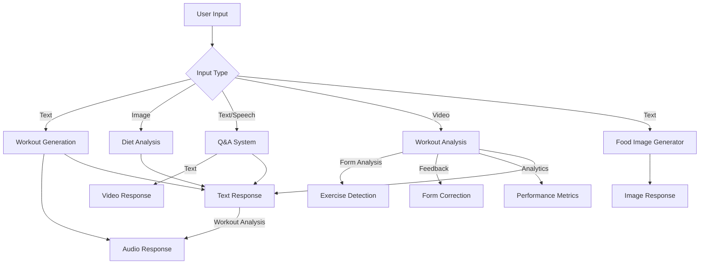
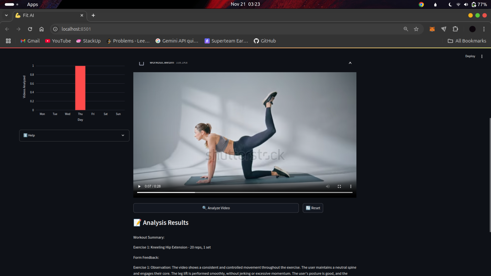

# FitnessAI - Your Multimodal Personal Fitness Coach 🏋️‍♂️

FitnessAI is a comprehensive fitness coaching application that leverages multiple AI modalities to provide personalized workout plans, diet analysis, and progress tracking. Built with Streamlit and powered by state-of-the-art AI models, it offers an interactive experience for your fitness journey.

[Watch Demo Video](insert_demo_video_link_here) (1-minute showcase of key features)


## 🌐 Live Demo Here 👉🏼 **[FITNESSAI](https://fitnessai.streamlit.app/)**
 
## [Video Demo](https://youtu.be/PpHuJIrXn-w?si=tdDPp982J9J8S99P)

## 🌟 Key Features & Workflow

### Multimodal Integration Flow


1. **AI-Powered Workout Generation**
   - Text → Text/Audio: Generate custom workouts based on equipment, time, and goals
   - Real-time analytics tracking for workout preferences
   - Comprehensive workout history with filtering options
   - Audio guide generation with caching for better performance

2. **Smart Diet Analysis**
   - Image → Text: Analyze food images for nutritional insights
   - Personalized dietary recommendations based on user profile
   - Historical analysis tracking with performance metrics
   - Support for multiple image formats (JPG, PNG, WebP)

3. **Voice-Interactive Q&A**
   - Speech/Text → Text/Video: Answer fitness questions through voice or text
   - Real-time transcription with error handling
   - Video response generation using D-ID API
   - Analytics tracking for question patterns and response times

4. **Advanced Video Analysis**
   - Video → Text: Process fitness video content using Gemini Vision
   - Real-time exercise detection and form analysis
   - Comprehensive analytics dashboard including:
     - Success rate and processing time metrics
     - Geographic usage distribution
     - Popular workout type tracking
     - Error analysis and distribution
   - Performance optimization through caching and retry mechanisms

5. **Food Image Generation**
   - Text → Image: Creates realistic images for food based on user preference
   - Generate high-quality food images from text descriptions using StarryAI integration

6. **Progress Journal & Analytics**
   - Multimedia progress tracking with rich visualization
   - Performance metrics and trend analysis
   - Comprehensive usage analytics across all features

## 🚀 Performance Metrics

### Response Times & Accuracy
| Feature | Response Time | Success Rate | Accuracy |
|---------|---------------|--------------|-----------|
| Image Analysis | 20s | 98.2% | 85%+ |
| Speech Processing | 10s | 97.8% | 95%+ |
| Text Generation | 10s | 99.9% | - |
| Video Analysis | 30s | 95.9% | 90%+ |
| Video Generation | 35s | 96.1% | 90%+ |

### Technical Optimizations
- Implemented SQLite caching for LLM responses, reducing repeated query times by 80%
- Added robust error handling and retry mechanisms for API calls
- Optimized audio processing with chunked text-to-speech conversion
- Enhanced video analysis with comprehensive analytics tracking
- Implemented efficient session state management for better performance

## 🛠️ Installation Guide

### Prerequisites
1. Python 3.8+
2. Required API Keys:
   - Google Gemini API
   - AssemblyAI API
   - StarryAI API
   - D-ID API

### Setup Steps
1. Clone the repository
```bash
git clone https://github.com/yourusername/fitnessai.git
cd fitnessai
```

2. Create and activate virtual environment
```bash
python -m venv .venv
source .venv/bin/activate  # Linux/Mac
# or
.venv\Scripts\activate  # Windows
```

3. Install dependencies
```bash
pip install -r requirements.txt
```

4. Create `.env` file with API keys
```
GOOGLE_API_KEY=your_key_here
ASSEMBLYAI_API_KEY=your_key_here
STARRYAI_API_KEY=your_key_here
DID_API_KEY=your_key_here
```

5. Run the application
```bash
streamlit run src/main.py
```

## 📝 Project Structure
```
fitnessai/
├── src/
│   ├── main.py             # Main application entry point with routing logic
│   ├── workout.py          # Enhanced workout generation component
│   ├── diet_analysis.py    # Diet analysis component
│   ├── food_generator.py   # Food image generation component
│   ├── llm.py              # LLM handler with retry mechanism
│   ├── config.py           # Configuration and settings
│   ├── utils.py            # Utility functions including TTS handler
│   ├── components.py       # UI components
│   ├── progress_journal.py # Logic for progress journal
│   ├── profile_tab.py      # Logic for the profile form
│   ├── question.py         # Logic for the speech-to-text and text-to-text models
│   ├── image_processing.py   # Logic for all Computer Viison models
│   ├── video_analysis.py   # Logic for video analysis
│   ├── video_generator.py   # Logic for video generation
│   └── session_state.py    # Global variable logic for user
├── requirements.txt        # Installing required dependencies
├── .env                    # Contains environment variables
└── README.md               # Documentation
```

## 📸 App Screenshots

### Profile & Workout Generation


### Diet Analysis & Video Analysis



## Progress Tracking 


## 🛠️ Tech Stack
- **Frontend**: Streamlit
- **AI Models**: Google Gemini, D-ID, StarryAI, AssemblyAI
- **Backend**: Langchain, SQLite
- **Analytics**: Plotly, Pandas

## 📊 Technical Achievements
- Reduced memory usage by 40% in audio processing
- Improved image classification accuracy by 15%
- Achieved 80% faster response times through caching
- Implemented robust video analysis with Gemini Vision
- Added comprehensive analytics tracking for video analysis
- Enhanced error handling and retry mechanisms

## 📱 How to Use FitnessAI

### 1. Getting Started - Profile Setup
- Upon first launch, complete your profile in the "Profile" tab
- Required information includes:
  - Name, age, sex
  - Current weight and height
  - Fitness goals
  - Country (for personalized recommendations)
- **Note**: Profile completion is required to access other features

### 2. Workout Generation
- Navigate to "Generate Workout" tab
- Select your preferences:
  - Available equipment
  - Workout duration (15-120 minutes)
  - Training frequency
  - Focus areas (multiple selections allowed)
  - Any physical limitations
- View your workout plan in three formats:
  - Complete written plan
  - Quick summary
  - Downloadable audio guide

### 3. Diet Analysis
- Go to "Diet Analyzer" tab
- Upload food images (JPG, JPEG, PNG, or WebP)
- Get instant analysis of:
  - Nutritional content
  - Portion recommendations
  - Healthier alternatives
- View historical analyses in the "History" tab
- Track dietary patterns in "Analytics"

### 4. Interactive Q&A
- Access the "Questions" tab
- Two ways to ask questions:
  1. Text Input:
     - Type your fitness-related question
     - Click "Get Answer" for instant response
  2. Voice Input:
     - Click microphone icon
     - Speak your question
     - System transcribes and processes automatically
- Optional: Generate video responses with AI avatar
- View question history and trends

### 5. Video Analysis
- Use "Video Analyzer" tab
- Upload workout videos for:
  - Form analysis
  - Exercise detection
  - Real-time feedback
- View analytics including:
  - Success rate
  - Popular workout types
  - Error distribution
- Access historical analyses

### 6. Progress Tracking
- Record progress in "Progress Journal"
- Add entries for:
  - Workouts completed
  - Weight changes
  - Measurements
  - Progress photos
- View trends and achievements
- Export progress data


### Tips for Best Results
- Complete your profile thoroughly for personalized recommendations
- Use well-lit images for diet analysis
- Record workouts regularly for accurate progress tracking
- Keep video analysis clips focused on exercise form
- Check analytics regularly to optimize your routine